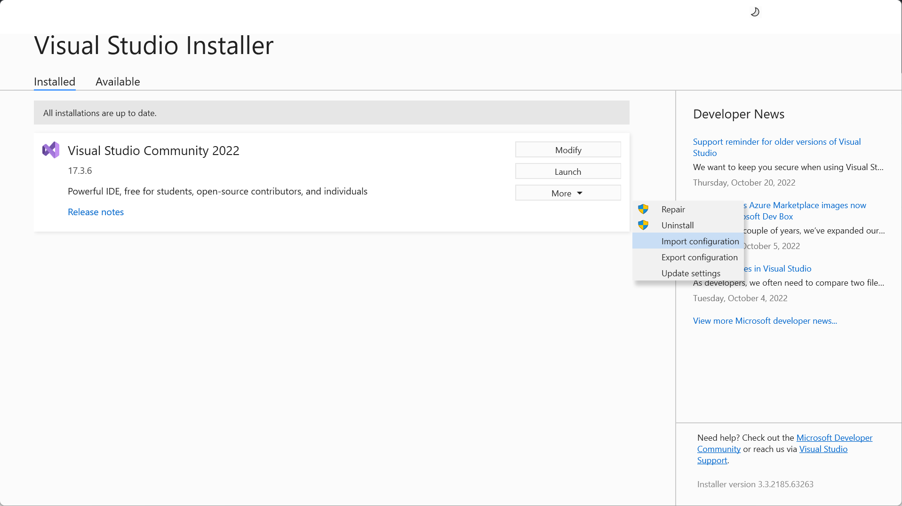

# ImageProcessingMFC
MFC (Microsoft Foundation Classes) based C++ application for implementation of image processing algorithms
***
## Prerequisites
### Visual Studio Community 2022
> After running `Visual Studio Installer`, select `More` - `Import configuration` menu to load `.vsconfig` file, and then proceed with the installation.

## Sample Images
> A directory named `images` contains headerless `RAW` images and `BMP` image samples.

## Visual Studio Solution Configurations
